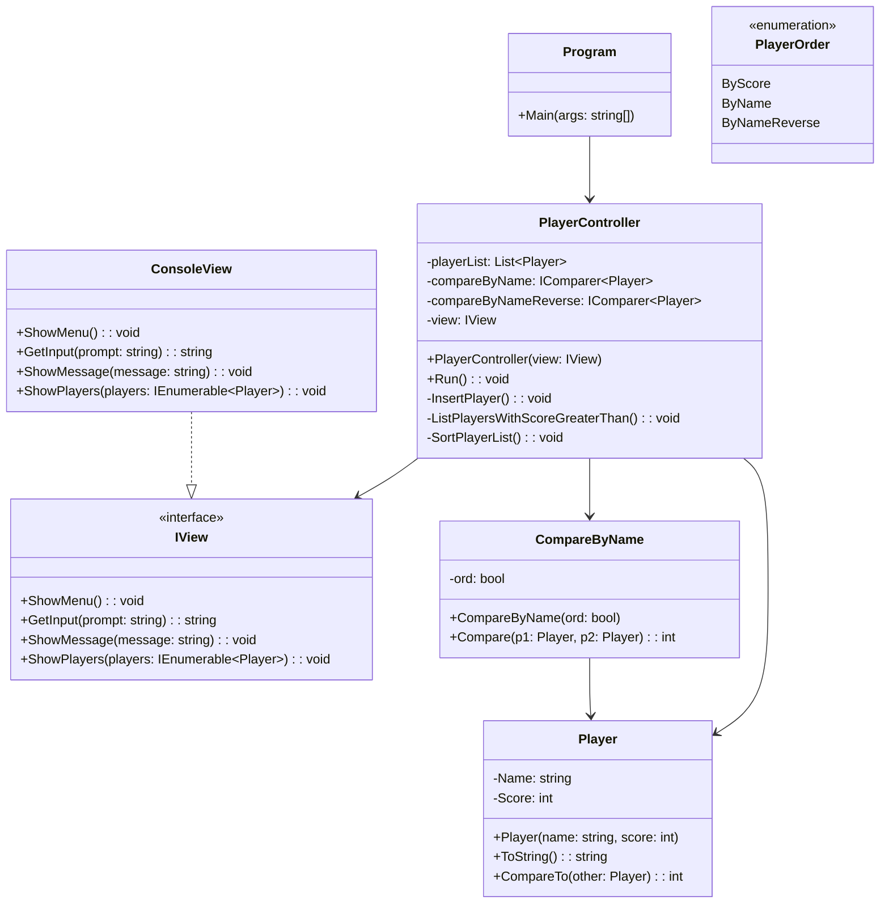

```mermaid
classDiagram
    class Program {
        +Main(args: string[])
    }

    class PlayerController {
        -playerList: List~Player~
        -compareByName: IComparer~Player~
        -compareByNameReverse: IComparer~Player~
        -view: IView
        +PlayerController(view: IView)
        +Run(): void
        -InsertPlayer(): void
        -ListPlayersWithScoreGreaterThan(): void
        -SortPlayerList(): void
    }

    class IView {
        <<interface>>
        +ShowMenu(): void
        +GetInput(prompt: string): string
        +ShowMessage(message: string): void
        +ShowPlayers(players: IEnumerable~Player~): void
    }

    class ConsoleView {
        +ShowMenu(): void
        +GetInput(prompt: string): string
        +ShowMessage(message: string): void
        +ShowPlayers(players: IEnumerable~Player~): void
    }

    class Player {
        -Name: string
        -Score: int
        +Player(name: string, score: int)
        +ToString(): string
        +CompareTo(other: Player): int
    }

    class CompareByName {
        -ord: bool
        +CompareByName(ord: bool)
        +Compare(p1: Player, p2: Player): int
    }

    class PlayerOrder {
        <<enumeration>>
        ByScore
        ByName
        ByNameReverse
    }

    Program --> PlayerController
    PlayerController --> IView
    ConsoleView ..|> IView
    PlayerController --> Player
    PlayerController --> CompareByName
    CompareByName --> Player
```